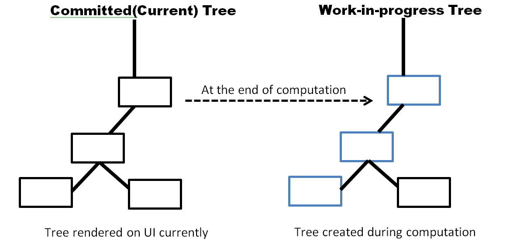
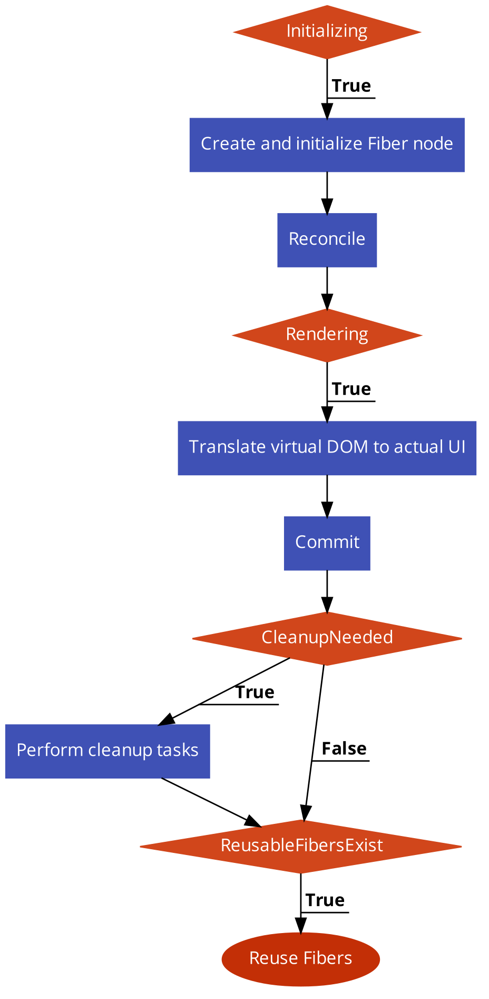
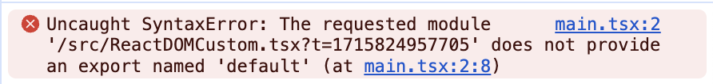
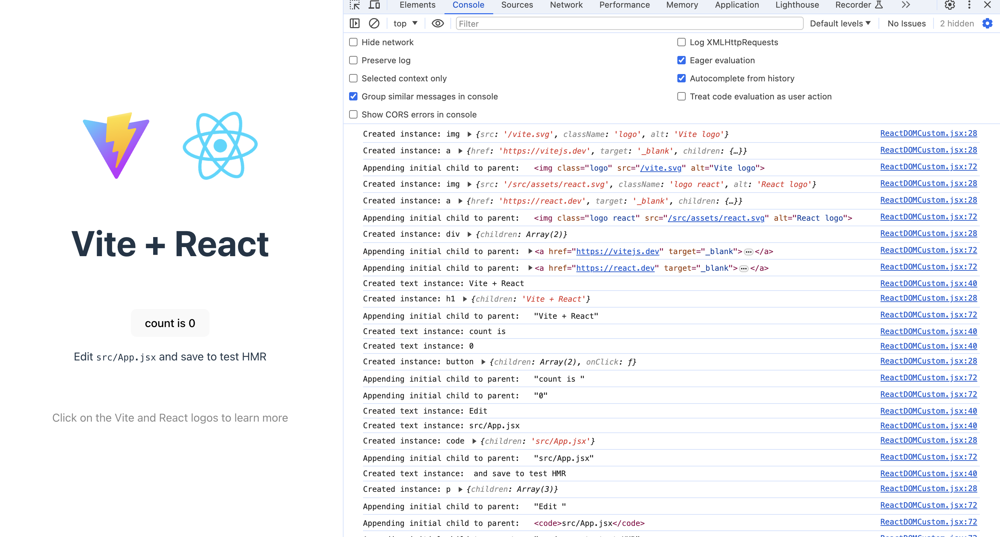
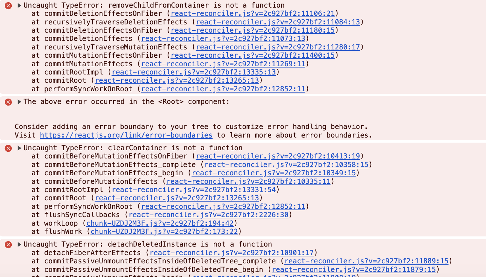

해당 게시글은 [Building A Custom Renderer For React](https://blog.openreplay.com/building-a-custom-react-renderer/) 번역을 바탕으로 한 글입니다.

react v18.2.0, react-reconciler v0.29.2 버전에서 작성되었으며, 버전에 따라 원본 글과 다른 부분이 있을 수 있습니다.

> React는 선언적인 프론트 개발 및 컴포넌트 기반 접근 방식으로 큰 인기를 얻었다. 핵심 기능으로는 컴포넌트를 UI 요소로 변환하는 Renderer가 있다. React는 주로 웹 용 렌더러인 ReactDOM을 사용하지만, 아키텍처의 유연성을 활용하여 특정 플랫폼이나 필요에 따른 사용자 정의 렌더러(Custom Renderer)를 만들 수 있다.

어플리케이션이 더욱 다양해지고 기존 웹 플랫폼을 넘어 확장됨에 따라 전문적인 렌더링 솔루션에 대한 수요가 증가하고 있다. 사용자 정의 렌더러의 필요성은 ReactDOM을 사용한 기본 렌더링 접근 방식이 최적이 아닐 때, 모바일 어플리케이션 또는 가상 현실, 서버 측 렌더링 등 새로운 환경을 목표로 할 때 발생한다.

개발자가 React의 기본 렌더링만을 사용하여 원하는 사용자 경험을 얻기에는 상당한 성능 병목 현상이나 어려움이 존재할 수 있다. 예를 들어, 수많은 실시간 업데이트나 정교한 차트를 통해 주식 시장 데이터를 동적으로 시각화하는 금융 분석 대시보드를 생각해보자. 이러한 경우, React의 기본 렌더링 접근 방식은 데이터의 연속 흐름이나 복잡한 차트 계산을 효율적으로 관리하지 못하기 때문에 사용자 정의 렌더러가 필요하게 된다.

사용자 정의 렌더러는 여러 가지 장점을 제공한다. 첫째, 특정 병목 현상을 해결하여 향상된 성능을 제공하고 기본 렌더러 접근 방식에 비해 렌더링 속도, 메모리 사용량 및 프레임 속도를 크게 향상시킨다. 예를 들어, 사용자 정의 렌더러는 재무 분석 대시보드 예시에서 데이터 처리 및 차트 렌더링을 최적화하여 더욱 원활하고 응답성이 뛰어난 대시보드 경험을 제공할 수 있다.

다음 섹션에서는 사용자 정의 렌더러를 구축하는 과정을 알아보고, 특정 프로젝트의 요구 사항을 충족하기 위해 React의 렌더링 기능을 확장하는 단계를 설명한다.

## 'react-reconciler' 패키지 개요 (Overview fo the react-reconciler package)

React 커스텀이라는 넓은 범위 내에서, [react-reconciler](https://www.npmjs.com/package/react-reconciler) 패키지는 개발자가 정확하고 효율적으로 사용자 정의 렌더러(Custom Renderer)를 구현할 수 있도록 지원하는 강력한 도구이다. 이 패키지는 커스텀 렌더러를 구현하기 위한 백본(뼈대)이며, React의 Reconciliation(재조정) 과정을 위한 구조화된, 확장 가능한 프레임워크를 제공한다.

React의 Reconciliation(재조정) 과정은 어플리케이션의 현재 상태를 반영하는 데 필요한 최소한의 변경 사항 집합을 결정하여 UI를 효율적으로 업데이트하는 역할을 한다. 이 react-reconciler 패키지는 커스텀 렌더러 구현을 간소화하는 일련의 인터페이스 및 유틸리티를 제공하여 개발자가 특정 사례에 맞게 Reconciliation(재조정) 과정을 수정할 수 있게 함으로써 중요한 역할을 한다.

### 목적 및 사용 사례 (Purpose and Use Cases)

react-reconciler 패키지의 주요 목적은 개발자가 프로젝트 요구 사항에 완벽하게 맞는 커스텀 렌더러를 구성할 수 있게 하는 것이다. 이러한 다양성은 기존 렌더링 접근 방식으로는 충분하지 않거나 특별한 문제를 해결하기 위해 맞춤형 솔루션이 필요할 때 특히 유용하다.

react-reconciler과 함께 구축된 커스텀 렌더러의 사용 사례는 다양하다.
네이티브 모바일 어플리케이션과 같은 특정 플랫폼의 성능을 최적화하는 것부터 게임 엔진이나 증강 현실 프레임워크와 같은 특별한 환경에 React를 통합하는 것까지 다양하다. 이 패키지를 활용함으로써 개발자는 표준 웹 렌더링의 한계를 넘어 React의 기능을 수많은 혁신적인 어플리케이션으로 확장할 수 있는 유연성을 얻는다.

### 파이버 아키텍처와의 관계 (Relationship with the Fiber Architecture)

react-reconciler 패키지는 Reconciliation(재조정) 과정의 효율성과 응답성을 향상시키기 위해 React의 Fiber Architecture와 밀접하게 연결되어 있다. Fiber와 협력함으로써, react-reconciler은 업데이트의 우선순위 지정 및 일정을 관리하는 강력한 인프라를 활용하고, 더욱 효율적이고 성능이 뛰어난 렌더링 시스템을 구축한다.

커스텀 렌더러를 구축하려는 개발자는 이 react-reconciler와 Fiber Architecture의 관계를 이해하는 것이 중요하다. 시너지 효과로는 커스텀 렌더러가 React의 핵심 아키텍처와 원활하게 통합되어 Fiber의 Incremental Rendering(증분 렌더링)의 이점을 활용하고, 부드럽고 반응성이 좋은 사용자 경험을 제공할 수 있도록 한다.

## 파이버 데이터 구조 탐색 (Exploring the Fiber Data Structure)

React의 Fiber는 Virtual DOM의 컴포넌트를 나타내는 작은 작업 단위이다. 이는 Reconciliation(재조정) 과정에서 중심 역할을 하여 React가 컴포넌트를 효율적으로 업데이트하고 렌더링할 수 있게 돕는다.

### 파이버 노드 해부학 (Fiber Node Anatomy)

Fiber 노드는 컴포넌트에 대한 정보를 저장하는 JavaScript 객체이다. 여기에는 아래와 같은 다양한 필드가 포함된다.

- Type: 컴포넌트의 유형(예: 함수, 클래스 등)
- Key: 업데이트를 최적화하기 위한 선택적 고유 식별자
- State: 컴포넌트의 현재 상태
- Props: 컴포넌트에 전달되는 속성
- Child, Sibling, and Return: 트리 구조를 형성하는 다른 Fiber 노드에 대한 포인터, 트리 구조는 어플리케이션의 컴포넌트 계층 구조를 나타낸다. "Child" 포인터는 현재 노드의 첫 번째 자식을 가리키고, "Sibling" 포인터는 현재 노드의 다음 형제를 가리킨다. "Return" 포인터는 현재 노드의 부모를 가리킨다.

### 작업 중인 파이버 트리 및 확정(커밋)된 파이버 트리 (Work-in-Progress and Committed Fiber Trees)

React는 Reconciliation(재조정) 과정 동안 두 개의 Fiber 트리를 유지한다. 작업이 진행 중인 트리(현재 변경 사항이 적용되고 있음)와 커밋된 트리(성공적으로 렌더링된 상태)이다. "Work-in-Progress Fiber Tree"는 작업 중인 React 컴포넌트의 현재 상태를 반영하는 동적 메모리 내 표현이다.
어플리케이션에서 state update나 prop 변경 등의 변경 사항이 발생하면 React는 새 버전의 컴포넌트 트리를 생성한다. 새롭게 생성된 이 트리는 진행 중인 변경 사항을 캡처하므로 작업 진행 트리라 한다.

반대로, "Committed Fiber Tree"는 사용자 인터페이스에서 성공적으로 렌더링된 마지막 상태를 나타낸다. Reconciliation(재조정) 과정이 완료되면 React는 업데이트된 "Work-in-Progress Fiber Tree"를 가져와서 새로운 "Committed Fiber Tree"로 지정한다. 이 "Committed Fiber Tree"는 가장 최근에 성공적으로 렌더링된 상태를 나타내며 사용자에게(화면에) 표시될 준비가 되었다.

아래 이미지에서는 커밋된 트리와 작업 진행 중인 트리 모두 표시된다. 파란색 외곽선이 있는 직사각형은 업데이트 된 노드를 나타낸다.



### Reconciliation(재조정) 알고리즘 (Reconciliation Algorithm)

Reconciliation(재조정) 알고리즘은 UI를 효율적으로 업데이트하기 위한 React의 핵심 기능이다. Fiber 트리를 활용하여 업데이트해야 할 컴포넌트와 그 순서를 결정한다. 알고리즘은 응답성과 처리량의 균형을 유지하여 원활한 사용자 경험을 보장한다.

## 파이버 노드 수명주기 (Fiber Node Lifecycle)

Fiber 노드의 수명주기는 렌더링 중 다양한 단계를 거치는 동적 프로세스이다.
Custom React Renderer를 구축하려면 이러한 단계를 이해하는 것이 중요하다.

- 초기화 (Initialization): 컴포넌트가 처음 렌더링되면 Fiber 노드가 생성되고 초기화된다. 여기에는 type, props, state가 포함된다. 이 단계는 Reconciliation(재조정) 과정의 시작점이다.
- 재조정 (Reconciliation): Reconciliation(재조정) 과정 동안, React는 Fiber 노드의 현재 상태와 새로운 상태를 비교한다. 변경된 사항을 식별하고 UI 업데이트 계획을 세운다. 이 과정에는 Fiber 트리를 통한 변경 사항 전파(Propagation)가 포함된다.
- 렌더링 (Rendering): 렌더링 단계에서는 Virtual DOM(가상 돔)을 실제 UI로 변환하는 작업이 포함된다. 이 과정은 커밋된 Fiber 트리를 활용하여 필요한 업데이트만 적용한다.
- 커밋 (Commit): 렌더링이 완료되면 React는 DOM에 변경 사항을 적용(커밋)한다. 이 단계를 수행하면 사용자에게 업데이트된 UI가 표시된다. 커밋된 Fiber 트리는 추후 업데이트를 위한 새로운 기반이 된다.
- 정리 (Cleanup): 변경 사항을 커밋한 후, React는 Cleanup(정리) 작업을 수행한다. 다음 렌더링 주기를 준비하기 위해 리소스를 해제하거나 내부 데이터 구조를 업데이트하는 작업이 포함될 수 있다.
- 재사용 할 수 있는 파이버들 (Reusable Fibers): React는 렌더링 전반에 걸쳐 Fiber를 재사용하여 성능을 최적화한다. 이는 새로운 객체를 생성할 필요성을 줄여 효율성을 향상시킨다.

아래 이미지는 Fiber 노드의 수명주기를 보여주는 순서도이다.



## 사용자 정의(커스텀) React 렌더러를 구축하는 단계 (Steps to Build a Custom React Renderer)

커스텀 렌더러는 모든 React 어플리케이션에 적용된다. 이 글에서는 특히 기본 React 단일 페이지 어플리케이션(이하 SPA)을 사용하여 테스트하는 데 중점을 둔다.

커스텀 렌더러 생성을 보여주기 위해 React 앱에서 사용하는 기본 렌더러를 의도적으로 제거하고 이를 커스텀 렌더러로 대체해보자. 이 커스텀 렌더러는 실제 웹 페이지에 React 페이지의 내용을 표시하는 역할을 한다.

기본 렌더러를 제거하면 처음에는 앱이 중단되어 오류가 발생한다. 그러나 기본적인 기능들을 커스텀 렌더러에 통합하면 기본 페이지가 다시 나타나서 웹 페이지에 다시 보이게 된다. 이 단계별 프로세스는 렌더러가 웹 페이지에 앱을 표시하기 위에 뒤에서 어떻게 작동하는지 이해하는 데 도움이 된다. 또한 커스텀 렌더러를 구성하기 위한 가이드 역할도 한다.

**(source code는 원문 글과 다르게 vite을 사용하여 작성되었습니다.)**

### 개발 환경 설정

터미널에서 React 어플리케이션을 생성하자. app_name 부분에는 원하는 어플리케이션 이름을 넣으면 된다.

```bash
pnpm create vite <app_name> --template react
```

어플리케이션이 생성되었으면 프로젝트 디렉토리로 이동한 후 다음 명령어를 실행하여 필요한 패키지를 설치한다.

```bash
cd <app_name>

pnpm install
```

어플리케이션을 실행하자!

```bash
pnpm dev
```

커스텀 렌더러를 위해, 필요한 의존성인 react-reconciler를 설치한다. 만약 TypeScript를 사용하는 경우 @types/react-reconciler도 함께 설치한다.

```bash
pnpm install react-reconciler
```

### 커스텀 렌더러 통합 (Integrating the Custom Renderer)

1. src 폴더 아래에 ReactDOMCustom.tsx 파일을 생성하고, 이 파일에서 react-reconciler를 import 한다.

```tsx
import ReactReconciler from "react-reconciler";
```

2. main.tsx 파일을 열고, ReactDOMCustom 파일을 import 한 후, ReactDOM을 import 하는 코드를 제거한다.

```tsx
import ReactDOMCustom from "./ReactDOMCustom.tsx";
```

3. 기존 ReactDOM.render() 함수를 ReactDOMCustom.render()로 변경한다.

```tsx
// 기존 렌더러 코드
ReactDOM.createRoot(document.getElementById("root")!).render(
  <React.StrictMode>
    <App />
  </React.StrictMode>
);

// 커스텀 렌더러 코드
ReactDOMCustom.render(<App />, document.getElementById("root")!);
```

이렇게 변경하게 되면 앱이 중단되고 브라우저 콘솔에 오류가 표시된다.



우리의 React 앱이 브라우저에서 예상대로 작동하도록 커스텀 렌더러의 기본 로직을 구현해보자.

### 커스텀 Host Config 구현 (Creating a Custom Host Config)

host config 파일은 React가 사용되는 호스트 환경의 동작과 기능을 정의하는 JavaScript 모듈을 나타낸다. 호스트 환경은 React 어플리케이션이 실행되는 플랫폼 또는 런타임이며 웹 브라우저, 모바일 앱 환경 또는 기타 런타임일수도 있다.

host config는 일반적으로 커스텀 렌더러가 반드시 구현해야 하는 메서드 집합을 포함한다. 이 메서드들은 인스턴스 생성 및 업데이트, 하위 항목(children) 추가, 텍스트 컨텐츠 처리 등과 같은 렌더링 과정의 다양한 측면에 해당한다. 이러한 메서드에 대한 커스텀 구현을 제공함으로써 대상 환경 내에서 React 요소가 생성, 업데이트 및 조작되는 방법을 제어할 수 있다.

ReactDOMCustom 파일에서, reconciler 객체를 생성함으로써 react-reconciler를 인스턴스화하고, 아래 메서드들을 추가한다.

```tsx
let reconciler = ReactReconciler({
  // host config options
  supportsMutation: true,
  createInstance(type, props, rootContainer, hostContext, internalHandle) {
    // Logic for creating new instance
  },
  createTextInstance(text, rootContainer, hostContext, internalHandle) {
    // Logic for creating a text instance
  },
  appendChildToContainer(container, child) {
    // Logic for appending a child to the container
  },
  appendChild(parentInstance, child) {
    // Logic for appending a child to a parent
  },
  appendInitialChild(parentInstance, child) {
    // Logic for appending initial child
  },
  prepareUpdate(
    instance,
    type,
    oldProps,
    newProps,
    rootContainer,
    hostContext
  ) {
    // Logic for preparing an update
  },
  commitUpdate(
    instance,
    updatePayload,
    type,
    prevProps,
    nextProps,
    internalHandle
  ) {
    // Logic for committing an update
  },
  finalizeInitialChildren() {
    // Logic for finalizing initial children
  },
  getChildHostContext() {
    // Logic for getting child host context
  },
  getPublicInstance() {
    // Logic for getting public instance
  },
  getRootHostContext() {
    // Logic for getting root host context
  },
  prepareForCommit() {
    // Logic before committing changes
  },
  resetAfterCommit() {
    // Logic after committing changes
  },
  shouldSetTextContent() {
    return false;
  },
  // 아래 코드는 원본 글과 다르게 추가된 코드입니다.
  clearContainer() {
    // Logic for clearing the container
    console.log("Clearing container:", container);
    while (container.firstChild) {
      container.removeChild(container.firstChild);
    }
  },
});
```

### createInstance()

이 메서드는 제공된 type과 props를 기반으로 HTML 요소를 생성하고 구성한다. document.createElement 메서드를 사용하여 지정된 타입의 새 HTML 요소를 생성한다. 그런 다음 props 객체에서 className 및 src와 같은 특정 속성을 확인하여, 존재하는 경우 생성된 요소에 적용한다.

이를 달성하기 위해 HTML 속성(alt, className, href, rel, src, target)을 나타내는 문자열 배열이 생성된다. 이 메서드는 이 배열을 반복하며 props 객체에 해당 속성이 있는 경우 요소에 해당 속성을 설정한다. 마지막으로 함수는 생성된 HTML 요소를 반환한다.

```tsx
// Define a function to create a new instance of an element
createInstance(
  type, // The type of element to create (e.g., "div", "span")
  props, // The properties (attributes) to apply to the element
  rootContainer, // The root container instance to which the element belongs
  hostContext, // The host context of the element
  internalHandle // The internal instance handle of the element
) {
  // Create a new HTML element based on the provided type
  let element = document.createElement(type);

  // Apply the className and src properties from the props object if they exist
  if (props.className) element.className = props.className;
  if (props.src) element.src = props.src;

  // Iterate through an array of specific attributes to check if they exist in the props object
  ["alt", "className", "href", "rel", "src", "target"].forEach((attr) => {
    // If the attribute exists in the props object, set it on the element
    if (props[attr]) element[attr] = props[attr];
  });

  // Log information about the created text instance
  console.log("Created instance:", type, props);

  // Return the created element
  return element;
},
```

### createTextInstance()

이 메서드의 목적은 사용자 인터페이스에서 텍스트 노드를 생성하는 것이다. 제공된 컨텐츠를 포함한 텍스트 노드를 반환함으로써 이를 수행한다. 구현 과정에는 document.createTextNode 메서드의 호출과 text를 인수로 전달하는 과정이 포함된다.

```tsx
// Define a function to create a new text instance
createTextInstance(
  text, // The text content of the instance
  rootContainer, // The root container instance to which the text belongs
  hostContext, // The host context of the text instance
  internalHandle // The internal instance handle of the text instance
) {
  console.log("Created text instance:", text);

  // Create a new text node with the provided text content
  return document.createTextNode(text);
},
```

### appendChildToContainer(), appendChild(), and appendInitialChild()

이 메서드들은 사용자 인터페이스 내의 parent 컨테이너에 child 요소를 추가하는 데 유용하다. 이들 간의 구별은 UI 렌더링 과정의 특정 사례 또는 수명 주기 이벤트를 기반으로 한다. 각 메서드는 브라우저에 내장된 appendChild API를 활용하고 child 요소를 인수로서 전달하여 이를 달성한다.

```tsx
// Function to append a child to a container
appendChildToContainer(container, child) {
  // Log information about appending child to container
  console.log("Appending child to container:", child);
  // Append the child to the container
  container.appendChild(child);
},
// Function to append a child to a parent element
appendChild(parentInstance, child) {
  // Log information about appending child to parent
  console.log("Appending child to parent:", child);
  // Append the child to the parent element
  parentInstance.appendChild(child);
},
// Function to append an initial child to a parent element
appendInitialChild(parentInstance, child) {
  // Log information about appending initial child to parent
  console.log("Appending initial child to parent:", child);
  // Append the initial child to the parent element
  parentInstance.appendChild(child);
},
```

### 렌더 메서드 활성화 (Enabling the Render Method)

재조정(Reconciliation) 객체의 API는 최상위 React DOM API와 약간 다르다. 렌더 메서드를 main.tsx 파일에 통합하려면 ReactDOMCustom.tsx 파일에서 render 메서드를 사용하여 객체를 정의해야 한다. 이 렌더 메서드는 두 개의 인수를 사용한다: 렌더링 할 component와 어디에 위치시킬 것인지 결정하는 container

```tsx
let ReactDOMCustom = {
  render(component, div) {
    // Logic for rendering
  },
};
```

render 함수 내에서 createContainer 메서드를 사용하여 새로운 컨테이너를 생성한다. 이 메서드는 세 가지 인수를 사용한다: container 그것 자체 인수와 동시성 모드(concurrent mode) 및 서버 측 하이드레이션(server-side hydration)을 나타내는 false로 설정된 boolean 두 값

```tsx
let container = reconciler.createContainer(div, false, false);
```

다음으로 렌더링 과정을 시작하기 위해 updateContainer 메서드를 호출한다. 이 메서드는 네 가지 인수를 필요로 한다: 렌더링된 component, 사전 설정된 container 그리고 하이드레이션 및 콜백 실행에 대한 옵션을 나타내는 두 개의 null 값

```tsx
reconciler.updateContainer(whatToRender, container, null, null);
```

참고로, 전체 render 메서드는 다음과 같다.

```tsx
// ReactDOMCustom object to encapsulate custom rendering logic
let ReactDOMCustom = {
  // Render method to render a React component into a specified container
  render(component, div) {
    // Create a container using the reconciler's createContainer method
    let container = reconciler.createContainer(div, false, false);

    // Update the container with the specified component to trigger the rendering process
    reconciler.updateContainer(component, container, null, null);
  },
};

export default ReactDOMCustom;
```

성공적으로 커스텀 렌더러가 구성되었다면, 브라우저에서 아래와 같은 결과를 확인할 수 있다.



## 실제 사례 (Real-World Examples)

커스텀 React 렌더러의 실제 사례는 React 아키텍처의 다양성과 적응성을 보여준다.

### 커스텀 리액트 렌더러의 사례 연구 (Case Studies of Custom React Renderers)

- React Three Fiber
  - 유명한 WebGL 라이브러리인 Three.js를 사용하여 3D 그래픽을 생성하도록 설계된 Custom React Renderer이다.
- React Native
  - React 컴포넌트를 가져와 iOS 및 Android의 기본 UI 컴포넌트를 렌더링한다.
- React ART
  - React를 사용하여 벡터 그래픽을 그리기 위한 라이브러리이다. Canvas, SVG로 출력하는 Custom React Renderer이다.
- React PDF
  - React 컴포넌트를 사용하여 PDF 문서를 생성하는 Custom React Renderer이다.
- React Hardware
  - React 컴포넌트를 사용하여 사물 인터넷(IoT) 어플리케이션을 구축할 수 있도록 Arduino, Raspberry Pi와 같은 하드웨어 구성 요소를 대상으로 하는 Custom React Renderer이다.

### 사용 사례 (Use Cases)

다음은 Custom React Renderer와 관련된 몇 가지 일반적 사용 사례이다.

- 특별한 UI 컴포넌트 (Specialized UI Components)
  - low-level의 렌더링 최적화 또는 특정 기술(예: 그래픽 라이브러리, 게임 엔진)과의 통합이 필요한 특별한 UI 컴포넌트에 대한 Custom React Renderer 구축
- 커스텀 플랫폼 또는 장치 (Custom Platforms or Devices)
  - 유니크한 요구사항들에 맞는 Custom Renderer를 구현하여 비표준 플랫폼 또는 장치(예: 사물 인터넷 장치, 사용자 정의 하드웨어)용 React 어플리케이션을 개발
- 도메인 특정 언어 (Domain-Specific Languages, DSLs)
  - 컴포넌트가 문서의 구조와 내용을 정의하는 동적 PDF 문서 생성과 같은 특정 사용 사례(use cases)에 대해 React를 사용하여 도메인 특정 언어(DSL)을 구현
- 3D 어플리케이션용 그래픽 사용자 인터페이스(GUI) (Graphic User Interfaces (GUIs) for 3D Applications)
- 성능 최적화 (Performance Optimization)
  - 기본 렌더링 프로세스로 인해 불필요한 오버헤드가 발생할 수 있는 시나리오에서 어플리케이션의 특정 요구 사항에 맞는 Custom React Renderer를 생성하여 성능을 최적화

### 이익 (Benefits)

Custom React Renderer는 다음과 같은 여러 이점들을 제공한다.

- 선언적 구문 (Declarative Syntax)
  - React의 선언적 구문을 활용하여 UI 컴포넌트를 명확하고 간결하게 표현하므로 개발자가 더 쉽게 이해하고 유지보수 할 수 있다.
- 코드 재사용성 (Code Reusability)
  - React 컴포넌트 내에 로직을 캡슐화하면 코드 재사용성이 향상된다. 이를 통해 개발자는 다양한 프로젝트나 시나리오에서 컴포넌트를 재사용할 수 있다.
- 생태계 호환성 (Ecosystem Compatibility)
  - 기존 React 생태계와 개발자 커뮤니티를 활용하여 React 개발자가 사용할 수 있는 다양한 라이브러리, 도구 및 리소스를 활용한다.
- 친숙한 개발 워크플로우 (Familiar Development Workflow)
  - 이미 React 경험이 있는 개발자를 위해 친숙한 개발 워크플로우를 유지한다. 커스텀 렌더러를 통해 개발자는 다양한 도메인에 React 패턴과 모범 사례를 적용할 수 있다.
- 복잡성 추상화 (Abstraction of Complexity)
  - UI 컴포넌트의 생성 및 관리를 단순화하는 high-level API를 제공함으로써 low-level 렌더링의 복잡한 세부 사항들을 추상화하고 개발자의 인지 부하를 줄인다.
- 크로스 플랫폼 개발 (Cross-Platform Development)
  - 개발자가 단일 코드 베이스를 사용하여 여러 플랫폼에 걸쳐 어플리케이션을 구축할 수 있도록 React Native와 같은 플랫폼을 위한 커스텀 렌더러를 생성하여 크로스 플랫폼 개발을 촉진한다.

## 결론 (Conclusion)

Custom React Renderer는 개발자에게 특정 플랫폼 및 사용 사례(use cases)에 맞게 프론트엔드 개발을 맞춤화할 수 있는 다양한 솔루션을 제공한다. 개발자는 React의 핵심 렌더링 개념과 react-reconciler 패키지를 활용하여 React Three Fiber와 React Native 같은 실제 사례처럼, 효율적으로 커스텀 렌더러를 구축할 수 있다.

---

## 원본 글과 다르게 코드를 추가한 부분

**reconciler에 clearContainer 메서드를 추가하지 않았을 경우**

```tsx
clearContainer() {
  while (container.firstChild) {
    container.removeChild(container.firstChild);
  }
},
```

다음과 같은 에러가 발생한다.



에러 메시지를 읽어보면 removeChildFromContainer, clearContainer, detachDeletedInstance 메서드를 추가해야 한다는 것을 알 수 있다. 이러한 메서드들은 커스텀 렌더러 내에서 요소들의 생명 주기를 관리하는 데 필요하다.

**그렇다면 왜 clearContainer 메서드만 추가하여도 문제가 해결될까 ❓**

여기서 clearContainer 메서드는 이미 모든 자식 요소를 제거하는 기능을 수행하고 있기 때문에, 이로 인해 다른 삭제 관련 메서드가 호출되지 않아서 에러가 발생하지 않는다. 하지만! 완전한 React Reconciler Host 설정을 위해서는 명확하게 removeChildFromContainer와 detachDeletedInstance 메서드를 추가해주는 것이 좋다.

이렇게 렌더러를 갈아끼울 수 있다는 것은 정말 신기한 부분 중 하나이다 ദ്ദിᐢ.\_.ᐢ₎
